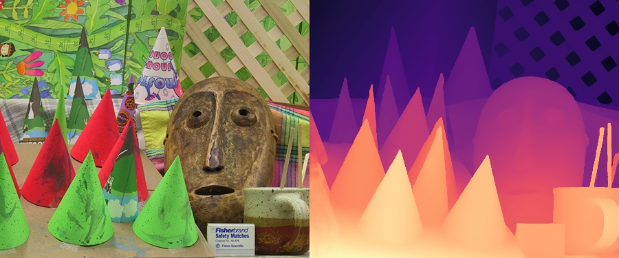

### Stereo Images to calculate the depth map

#### Depth Is Essential For 3D Vision
Measuring distance relative to a camera remains difficult but absolutely key to unlocking exciting applications such as autonomous driving, 3D scene reconstruction and AR. In robotics, depth is a key prerequisite to perform multiple tasks such as perception, navigation, and planning.

### Visualization

Run image_depth_estimation.py to visualize the results

Reference - https://github.com/ibaiGorordo/ONNX-HITNET-Stereo-Depth-estimation/tree/main

_author : ju7stritesh@gmail.com_